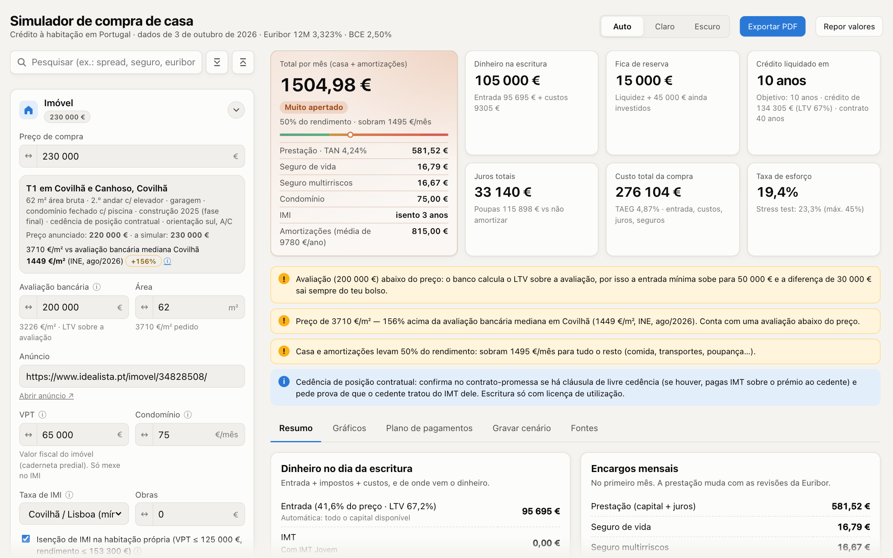
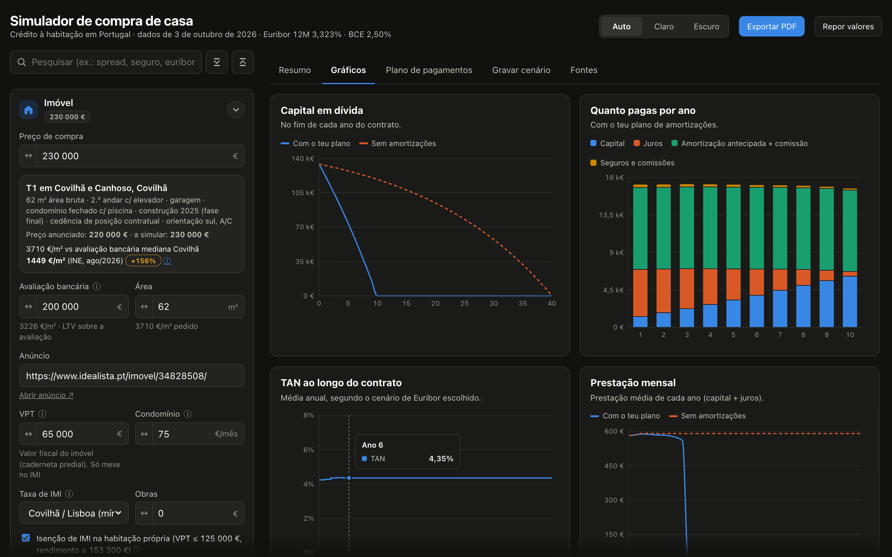

<div align="center">


# Simulador Casa

**Simula a compra da tua casa em Portugal antes de assinar: do primeiro euro de entrada à última prestação.**

[](#)
[](https://simulador-casa.pages.dev)
[](#dados-e-fontes)
[](#qualidade)

[**Abrir a app →**](https://simulador-casa.pages.dev)



</div>

---

## Porquê

Comprar casa em Portugal tem mais variáveis do que um simulador de banco mostra: IMT e IMT Jovem, Imposto do Selo, avaliação abaixo do preço, Euribor que muda a cada revisão, comissões de amortização, a taxa de esforço que o Banco de Portugal aplica com stress test… e, no fim, a pergunta que interessa: **quanto me sai do bolso por mês, e consigo pagar?**

O Simulador Casa junta tudo isto numa só página, com dados reais de mercado e as fontes ao lado de cada número. Mexes num valor e vês o efeito em tudo o resto, ao vivo.

## Destaques

- **O total que realmente pagas.** Prestação, seguros, condomínio, IMI e amortizações num só valor, com um indicador de esforço (confortável → apertado → impossível) calculado sobre o teu rendimento.
- **Liquidar em N anos.** Define o objetivo e o simulador calcula quanto tens de amortizar por mês, trimestre ou ano, incluindo a comissão de 0,5% e o respetivo Imposto do Selo.
- **Euribor realista.** Cenários a partir da curva forward do mercado (mais constante, subida, descida e stress do BdP) ou uma trajetória tua, ano a ano. A taxa é revista a cada 3, 6 ou 12 meses, como no contrato.
- **Impostos e custos de 2026.** Tabelas de IMT do OE2026, IMT Jovem com isenção proporcional à quota de cada comprador, Imposto do Selo, Casa Pronta, preçários dos principais bancos.
- **Avaliação bancária.** O LTV é calculado sobre o menor entre o preço e a avaliação. Se o banco avaliar abaixo do preço, o simulador mostra quanto a mais tens de pôr.
- **Entrada automática.** Toda a liquidez disponível, depois de impostos, custos, recheio e fundo de emergência, vai para a entrada. Também há modo manual.
- **Orçamento completo (opcional).** Junta as despesas do dia a dia e os investimentos mensais para mostrar quanto sobra mesmo do salário no fim do mês.
- **Relatório PDF.** Seis páginas com resumo, pressupostos, gráficos, plano de pagamentos, cenários e fontes, prontas para levar ao banco.
- **Ligado à app de Finanças.** Liquidez, investimentos, mais-valias e despesas recorrentes vêm da app [Finanças](https://github.com/ojoaobrito/FinanceHub): editas lá e o simulador atualiza.
- **Cenários na nuvem.** Grava, compara lado a lado e recarrega simulações em qualquer dispositivo.

<table>
  <tr>
    <td width="60%"></td>
    <td width="40%"></td>
  </tr>
  <tr>
    <td align="center"><sub>Capital em dívida, pagamentos anuais, TAN e prestação</sub></td>
    <td align="center"><sub>Funciona no telemóvel</sub></td>
  </tr>
</table>

## Funcionalidades

### Imóvel e capitais próprios
- Preço, avaliação bancária, área (€/m² comparado com a mediana de avaliação do INE), VPT, condomínio, taxa de IMI por município e isenção de 3 ou 5 anos.
- Compra por **cedência de posição contratual**, com o IMT sobre o prémio pago ao cedente quando o CPCV tem cláusula de livre cedência.
- Poupança, investimentos a resgatar (com imposto sobre mais-valias), decoração e recheio, fundo de emergência.
- Custos da compra editáveis linha a linha: Imposto do Selo do crédito, escritura e registos, avaliação, dossier, solicitador.

### Despesas do dia a dia (opcional)
- Lista editável de despesas mensais e anuais (com o mês de cobrança), agrupadas por categoria, importada de uma folha de cálculo pessoal.
- Investimentos e poupança à parte: sobra antes e depois de investir, e o mês em que as despesas anuais pesam mais.

### Crédito
- Taxa **variável, mista ou fixa**, com propostas pré-preenchidas de 12 bancos (preçários de outubro de 2026) e a média de mercado do BdP.
- Prazo até 40 anos, com o máximo do BdP por idade.
- Alertas de LTV, taxa de esforço (limite de 45% com stress test), prazo e idade no fim do contrato.

### Amortizações antecipadas
- Objetivo de liquidação em N anos, ou plano periódico manual com início e fim.
- Amortizações pontuais (prémios, heranças, venda de investimentos).
- Reduzir prazo ou reduzir prestação.
- Comissões de 0,5% (variável) e 2% (fixa ou período fixo da mista), com opção para simular a abolição em discussão no Parlamento.

### Resultados
- Indicadores principais, alertas contextuais e três vistas: **Resumo**, **Gráficos** e **Plano de pagamentos** mensal ou anual, exportável para CSV.
- **TAEG estimada** a partir dos fluxos reais (seguros, comissões e impostos incluídos).
- **Fontes** com ligação direta a cada documento usado.

### Experiência
- Campos numéricos ao estilo Figma: arrasta o ícone ↔ para mudar o valor (Shift ×10, Alt ÷10); junto às bordas da janela o valor continua a mudar sozinho.
- Pesquisa nos parâmetros (atalho <kbd>/</kbd>) que filtra secções, destaca o campo e faz scroll até ele.
- Tema claro, escuro ou automático; animações que respeitam "reduzir movimento".

## Como funciona

| Peça | O que faz |
|---|---|
| **Motor do crédito** (`src/lib/loan.ts`) | Simulação mês a mês pelo sistema francês. Em taxa variável a prestação é recalculada em cada revisão do indexante; a Euribor evolui ao longo do ano por interpolação entre os valores anuais do cenário. |
| **Objetivo de liquidação** | Pesquisa binária sobre o valor de cada amortização até o crédito terminar no prazo pedido. |
| **TAEG** | TIR anualizada dos fluxos do crédito sem amortizações, incluindo custos iniciais, seguros e comissões. |
| **Impostos** (`src/lib/taxes.ts`) | IMT 2026 por escalões, IMT Jovem total ou parcial, Imposto do Selo na compra e no crédito, IMT na cessão de posição. |
| **Entrada automática** (`src/model.ts`) | Ponto fixo entre a entrada e o Imposto do Selo do crédito, que depende do montante financiado. Converge em poucas iterações. |

## Dados e fontes

Todos os dados de mercado vivem num só ficheiro, **`src/data/market.ts`**, com a data e o URL de cada fonte. A versão 1.0.0 usa dados recolhidos a **3 de outubro de 2026**:

- Euribor 3M / 6M / 12M diária e curva forward (EMMI, BlueGamma), decisões do BCE.
- Spreads, taxas fixas e mistas e comissões nos preçários oficiais de CGD, Millennium bcp, Santander, Novobanco, BPI, Bankinter, ActivoBank, CTT, Crédito Agrícola, Montepio e Abanca.
- Recomendação Macroprudencial n.º 1/2026 do Banco de Portugal (LTV, DSTI 45%, maturidade, stress test).
- Tabelas de IMT do OE2026, IMT Jovem (DL 48-A/2024), Imposto do Selo, Casa Pronta, IMI municipal.
- Mercado local: avaliação bancária e preços de venda do INE.

Para atualizar, edita `market.ts` e volta a publicar. A app mostra a data dos dados no cabeçalho.

## Começar

Requisitos: **Node 22** e **Yarn 4** (via corepack).

```sh
nvm use
corepack enable
yarn install
yarn dev            # http://localhost:5173
```

| Comando | Descrição |
|---|---|
| `yarn dev` | Servidor de desenvolvimento (cenários gravados só no browser) |
| `yarn test` | Testes do motor de cálculo, impostos e modelo (Vitest) |
| `yarn lint` | Lint (oxlint) |
| `yarn build` | Verificação de tipos e build de produção |
| `yarn cf:dev` | App + API de cenários localmente, como no Cloudflare (http://localhost:8788) |
| `yarn deploy` | Build e publicação no Cloudflare Pages |

## Deploy

A app corre no **Cloudflare Pages** (plano gratuito), com uma Pages Function em `functions/api/scenarios.ts` que guarda os cenários num namespace **Workers KV** (`SCENARIOS`, configurado em `wrangler.toml`).

```sh
yarn wrangler login
yarn deploy
```

O acesso à API exige um código (`APP_TOKEN`, definido como segredo do projeto). Para o mudar:

```sh
yarn wrangler pages secret put APP_TOKEN --project-name simulador-casa
```

e atualiza a constante `BUILT_IN_TOKEN` em `src/storage.ts`, que tem de coincidir.

### Partilhar com outras pessoas

Quem entra pelo Cloudflare Access é identificado pelo email (`/api/me`):

- **Dono** (emails no segredo `OWNER_EMAILS`, separados por vírgulas): começa com os valores próprios, tem a ligação à app de Finanças e usa a lista de cenários principal.
- **Qualquer outra pessoa** autorizada no Access: começa com valores de exemplo (sem anúncio nem dados pessoais), não vê a ligação à app de Finanças (`/api/finance` responde 403) e tem a sua própria lista de cenários (`scenarios:<email>` no KV).

```sh
yarn wrangler pages secret put OWNER_EMAILS --project-name simulador-casa
```

Cada cenário guarda tudo o que está no ecrã: todos os parâmetros (incluindo o anúncio e as despesas), os valores da app de Finanças dessa altura e as secções abertas. Ao carregar, repõe-se exatamente isso.

## Arquitetura

```
src/
├── data/market.ts        Dados de mercado, regras do BdP e fontes
├── lib/
│   ├── loan.ts           Motor do crédito, objetivo de liquidação, TAEG
│   ├── taxes.ts          IMT, IMT Jovem, Imposto do Selo, cessão
│   ├── effortColor.ts    Escala de cor do esforço
│   └── format.ts         Formatação pt-PT
├── model.ts              Liga tudo: inputs → resultados e alertas
├── state.ts              Parâmetros, valores por defeito, persistência local
├── storage.ts            Cenários gravados (nuvem ou browser), import/export
├── financeSync.ts        Ligação à app de Finanças
├── components/           Interface (painel, resumo, gráficos, campos, pesquisa)
└── pdf/                  Relatório PDF (@react-pdf/renderer, carregado a pedido)
functions/api/            API de cenários (KV) e proxy para a app de Finanças (/api/finance)
```

**Stack:** React 19, TypeScript, Vite, Recharts, @react-pdf/renderer, Vitest, Cloudflare Pages + Workers KV.

## Qualidade

- 27 testes sobre o motor do crédito (prestação, revisões, taxa mista, amortizações, objetivo, TAEG), impostos (IMT 2026, IMT Jovem, quotas) e modelo (entrada automática, custos, esforço, despesas do dia a dia).
- TypeScript estrito e lint sem avisos.
- Cada parâmetro do painel foi verificado para garantir que altera o resultado; os que não se aplicam ficam desativados ou escondidos.

## Privacidade

- Os parâmetros da simulação ficam no teu browser.
- Os cenários gravados ficam no Workers KV da tua conta Cloudflare.
- O código de acesso à API está embutido na app (é um projeto pessoal, partilhado com poucas pessoas). Quem tiver o link pode ver e editar os cenários; **mantém este repositório privado**.

## Aviso

O Simulador Casa é uma ferramenta de apoio à decisão. Os valores são estimativas: a Euribor futura é incerta, e a avaliação, o VPT e o condomínio dependem de documentos que só tens mais tarde. Confirma sempre a FINE do banco e, para a escritura e a cessão de posição contratual, fala com um solicitador.
